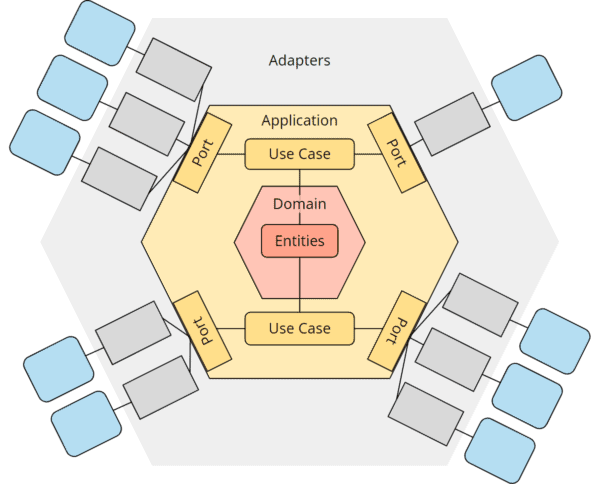

# Task - Exercise

I used hexagonal architecture in this project to separate the core logic of the application from the external dependencies. This architectural pattern allows for easier testing, maintainability, and flexibility.

Here is an illustration of the hexagonal architecture (i took image from google):

The architecture consists of the following components:

- **Domain**: Contains the core business logic and entities of the application.
- **Application**: Implements the use cases and orchestrates the interactions between the domain and infrastructure layers.
- **Infrastructure**: Provides implementations for external dependencies such as databases, APIs, and frameworks.

Additionally, logging plays an important role in this architecture. It helps track and debug the application's behavior. Here is an illustration of the logging setup:

**IMPORTANT**: This project goal was not implement exact “flight status” functionality, but only to show what could be a perfect architecture for such service(s).

To see the code files for this project, please visit the following repository: ‣